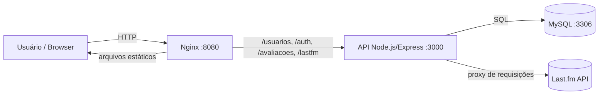

# 🎵 SoundMark

> Aplicação web para avaliar músicas e artistas, com autenticação de usuários, persistência em MySQL e integração com a API do **Last.fm**. Todo o ambiente é orquestrado via **Docker Compose** (Nginx + Node.js/Express + MySQL).

---

## 📌 Visão Geral

O SoundMark permite que um usuário:

* Crie uma conta e faça login (sessão autenticada)
* Busque artistas e músicas usando a API do Last.fm
* Registre avaliações (nota de 1 a 5, comentário e capa do álbum) das músicas que ouviu
* Liste, edite seus dados e exclua suas próprias avaliações

---

## 🏗️ Arquitetura



A aplicação roda em três containers:

| Container | Papel |
| --- | --- |
| `nginx_lab` | Serve o frontend estático e faz proxy reverso das rotas da API |
| `app_lab` | API Node.js/Express (autenticação, usuários, avaliações, proxy Last.fm) |
| `mysql_lab` | Banco de dados MySQL 8, com volume persistente |

---

## 📦 Estrutura do Projeto

```text
soundMark/
├── docker-compose.yml
├── .env                       # LASTFM_API_KEY
├── db/
│   └── init.sql               # criação das tabelas usuarios e avaliacoes
├── nginx/
│   └── default.conf           # proxy reverso para a API
├── app/                       # API Node.js
│   ├── Dockerfile
│   ├── package.json
│   ├── server.js              # bootstrap do Express
│   ├── db.js                  # pool MySQL + migrations automáticas
│   ├── middlewares/
│   │   └── auth.js            # exige sessão autenticada
│   ├── controllers/
│   │   ├── authController.js
│   │   ├── usuariosController.js
│   │   ├── avaliacoesController.js
│   │   └── lastfmController.js
│   ├── services/
│   │   ├── usuariosService.js
│   │   └── avaliacoesService.js
│   └── routes/
│       ├── auth.js
│       ├── usuarios.js
│       └── lastfm.js
└── frontend/                  # HTML/CSS/JS puro
    ├── index.html / app.js    # cadastro/login
    ├── home.html / home.js    # busca e avaliação de músicas
    ├── user.html / user.js    # perfil e avaliações do usuário
    ├── frontend.lastfm.js     # chamadas à API do Last.fm via proxy
    └── style.css
```

---

## ⚙️ Stack Tecnológica

| Camada | Tecnologia |
| --- | --- |
| Frontend | HTML, CSS e JavaScript puro |
| Proxy / Servidor estático | Nginx |
| Backend | Node.js + Express |
| Sessão | express-session |
| Hash de senha | bcryptjs |
| Banco de Dados | MySQL 8 (driver `mysql2`) |
| API externa | Last.fm |
| Containers | Docker + Docker Compose |

---

## 🚀 Como executar

### 1. Pré-requisitos

* Docker e Docker Compose instalados
* Uma chave de API do Last.fm ([obter aqui](https://www.last.fm/api/account/create))

### 2. Configurar variáveis de ambiente

Dentro de `soundMark/`, crie/edite o arquivo `.env`:

```env
LASTFM_API_KEY=sua_chave_aqui
```

### 3. Subir o ambiente

```bash
cd soundMark
docker-compose up -d --build
```

### 4. Acessar a aplicação

* Frontend: http://localhost:8080
* API (sem passar pelo Nginx): http://localhost:3000

### 5. Parar o ambiente

```bash
docker-compose down
```

Para remover também os dados do banco:

```bash
docker-compose down -v
```

---

## 🧠 Banco de Dados

O script `db/init.sql` é executado automaticamente na primeira inicialização do container MySQL e cria as tabelas:

* **usuarios** — `id`, `nome` (único), `senha_hash`, `created_at`
* **avaliacoes** — `id`, `usuario_id` (FK), `musica`, `artista`, `nota` (1–5), `comentario`, `capa_url`, `created_at`

Além disso, o arquivo `app/db.js` executa migrations idempotentes a cada inicialização da API, garantindo que a tabela `avaliacoes` exista com todas as colunas mesmo em volumes antigos.

| Parâmetro | Valor |
| --- | --- |
| Host | mysql |
| Porta | 3306 |
| Database | lab_db |
| Usuário | user |
| Senha | user123 |

---

## 🌐 Endpoints da API

### Autenticação (`/auth`)

| Método | Rota | Descrição |
| --- | --- | --- |
| POST | `/auth/cadastro` | Cria um novo usuário (nome, senha, confirmarSenha) |
| POST | `/auth/login` | Autentica o usuário e abre sessão |
| POST | `/auth/logout` | Encerra a sessão |
| GET | `/auth/me` | Retorna o usuário autenticado na sessão |

### Usuários (`/usuarios`) — requer login

| Método | Rota | Descrição |
| --- | --- | --- |
| GET | `/usuarios` | Lista todos os usuários |
| GET | `/usuarios/:id` | Busca um usuário por ID |
| PUT | `/usuarios/:id` | Atualiza o nome de um usuário |
| DELETE | `/usuarios/:id` | Remove um usuário |

### Avaliações (`/avaliacoes`) — requer login

| Método | Rota | Descrição |
| --- | --- | --- |
| POST | `/avaliacoes` | Cria uma avaliação (música, artista, nota, comentário, capa_url) |
| GET | `/avaliacoes` | Lista as avaliações do usuário logado |
| DELETE | `/avaliacoes/:id` | Remove uma avaliação do usuário logado |

### Last.fm (`/lastfm`) — proxy para a API externa

| Método | Rota | Parâmetros | Descrição |
| --- | --- | --- | --- |
| GET | `/lastfm/artist-info` | `artista` | Informações sobre um artista |
| GET | `/lastfm/top-tracks` | `limite` (opcional) | Ranking de músicas mais populares |
| GET | `/lastfm/track-search` | `termo`, `limite` (opcional, padrão 18) | Busca músicas por termo |

### Health check

| Método | Rota | Descrição |
| --- | --- | --- |
| GET | `/health` | Verifica se a API está no ar |

---

## 🔐 Autenticação

A autenticação é feita via **sessão** (`express-session`), armazenada em memória no servidor. Após login ou cadastro, o servidor guarda `{ id, nome }` na sessão e o middleware `exigirLogin` bloqueia rotas protegidas (usuários, avaliações) para quem não estiver autenticado, retornando `401`.

